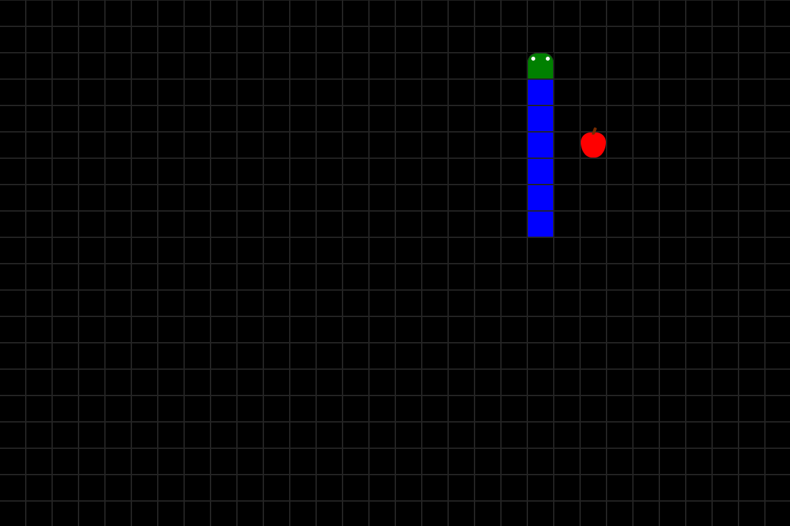

# Snek

[](https://dotnet.microsoft.com/en-us/download/dotnet/9.0)
[](https://opensource.org/licenses/MIT)

Snek is a game about getting long snek. Try to get a long snek:
[snek-game.azurewebsites.net](https://snek-game.azurewebsites.net)



This project was created in December 2023 to learn more about Blazor and its
(then) new rendermode, InteractiveAuto. It is built upon the Blazor template
from Microsoft with Microsoft's Identity library, which includes a working login
and account management profile. The game itself was then added, along with a
leaderboard for competitive play.

At a later point, proper IaC was written for the project infrastructure and a
GitHub Workflow was set up to handle continuous deployment of Azure
infrastructure. The project was also updated to .NET 9 and the code was
refactored. Additionally, new features were added, such as replay files, replay
validation and profile statistics.

## Additional documentation

- [GitHub Workflows](/documentation/workflows.md)
- [Run project locally](/documentation/getting-started.md)

## Technology

Snek is an ASP.NET Core Blazor web application running with hybrid (server/wasm)
rendermode introduced in ASP.NET Core 8.

Most of the website is rendered with Static SSR (Server Side Rendering), such as
the login and account pages. However, the game itself is rendered using
automatic rendermode. This means on the first render, it will use Interactive
SSR while loading the .NET WebAssembly runtime in the background. When this is
loaded, it will switch over to Interactive WebAssembly Rendering and run on the
client. This is needed to ensure low input latency when playing the game. While
the game is loading and displaying with Interactive SSR, playing is not
possible, and it will simply display a loading screen.

## Anti-Cheat

Because the game is running on the client, cheating is inherently unsolvable.
However, mitigations can be made to make cheating more difficult. Below are the
different iteration we went through when implementing the current anti-cheat 
system we have today:

### Initial release

In the first version of this game, a very simple approach was implemented, where
highscores were submitted via an HTTP POST request containing the following
body:

```json
{
  "score": x
}
```

While being quite effective for honest players, this approach is extremely easy
to exploit by simply replaying the request with a different score. This way, a
cheater could submit any score as long as it would fit in a signed 32-bit 
integer.

### Second iteration

After verifying that the logic of the game itself was working and scores were
submittable, work was put in to ensure the validity of highscore requests.

An updated API now included a checksum of the score object. This checksum was
computed in a convoluted manner to avoid hackers guessing the algorithm.

    At this point in time the source code was still closed-source, so hackers
    would need to decompile the WebAssembly binary to discover its secrets.
    Due to the way ASP.NET changed its WebAssembly compiler in .NET 8, a
    decompiler was not yet available in december 2023. This is no longer the
    case and decompilation of the Web.Client project is easily acclomplished.
    It turns out .NET's WebAssembly compiler does not remove strings and labels
    when compiling, so decompilation will reveal all class and varaible names
    in the original code (!)

The checksum was first padded with a static string, then sent through the SHA1
hash algorithm, before sending this hash through SHA256. While being trivial to
compute with the source code available, this was not as easy when this update
was pushed. The POST request now has a body with the following format:

```json
{
  "score": x,
  "checksum": "a94a8fe5ccb19ba61c4c0873d391e987982fbbd3"
}
```

This anti-cheat measure was defeated using the
[Cetus](https://github.com/Qwokka/Cetus) tool for hacking WebAssembly games by
changing the score value in the game's memory before the game finishes, thus
bypassing the need to manually create the checksum, as the checksum will be
calculated by the game automatically. The Cetus extension works in a very
similar way to how [CheatEngine](https://www.cheatengine.org/) works for desktop
games.

### Third iteration

To attempt mitigation of the memory manipulation exploit, server side replay
validation was added to the highscore endpoint. From this API version onwards,
a replay file is required in all submitted runs. The POST request now has a body
with the following format:

```json
{
  "replay": {
    "score": 1,
    "seed": 1343454789,
    "inputs": {
      "0": 3,
      "5": 2,
      "13": 3,
      "14": 4,
      "23": 1
    }
  },
  "checksum": "6XMHqS1TLFIM6iYKw2SiPMTlO0CWDKsJi+x+LIct4DE="
}
```

When a run is submitted through the score endpoint, the server sets up a game
with the random seed provided by the replay. The server then plays this game
with the inputs defined in the "inputs"-section of the replay. When the game is
over, the server compares the score it got, with the score reported in the
replay sent by the client. If, and only if, these scores match, the score is
saved in the database.

### Fourth iteration

To avoid the user being able to hand-pick their own seed, server-side seed
generation was implemented. With this new setup, before starting each game, the
client must send a POST to `/api/game/start` which generates a new seed and an
accompanying timestamp. The seed and the timestamp are stored in the database,
while a copy of just the seed is sent back to the user in the server response:

```json
{
  "seed": 123456789
}
```

When the user eventually submits their run, not only must the replay itself be
valid, but the seed must also correspond to the one in the database. Only one
seed is stored at any point, and sending a new POST to the start endpoint
always overwrites the old seed.

Additionally, to block hackers submitting runs that might still pass this check,
a validation for the minimum time was added. In short, the number of ticks in
the submitted replay must correspond with the time since the seed was generated.
To calculate this, the number of ticks in the replay is multiplied by the length
of one tick. This product is the absolute minimum duration of one game. If this
time span is less than the time since the seed was generated the run must have
been cheated.

1. The score in the request must be greater than 0
2. There must be a seed and a seed timestamp stored in the database on the
   submitting user.
3. The seed in the request must be identical to the one stored in the database.
4. The minimum duration of the replay is calculated and compared with the time
   since the seed was generated.
5. The game is simulated with the replay's seed and inputs. The resulting score
   must be equal to the score reported in the request.
  
If one of the above checks fail to validate, the replay is discarded and an
error message is displayed to the user.

### Future

It is still quite possible to cheat in this game, especially now that the code
is open-source. Some ideas for future anti-cheat protection are presented below.
However, as the anti-cheat measures get more sophisticated it becomes harder and
harder to implement them without affecting users who don't cheat.

- Maximum game duration
  - A limit for the maximum game duration could be implemented to mitigate cheaters
    hand-crafting their inputs, which could take a long time.
  - A game should at most have a duration just a little bit higher than the
    minimum duration.
    - Here it is very important to account for network connections with high
      ping and other unknown factors that might delay the submission of a
      non-cheated run.
  - This setup would require an auto-start feature such that the user would not
    be able to sit idle before starting the game.
- Bot detection
  - Bot detection could be possible by detecting repeated patterns that bots
    might utilise. Possible patterns are:
    - Zig-zag covering the whole screen from left to right or top to bottom.
      - This strategy is almost required even by humans when reaching the end of
        the game, so this would be tough to conclusively flag as botted.
    - Going to the top left, then movign across the top to the right and turning
      downwards when the head is on the same column as the food.
      - This strategy has some problems when the snake reaches a certain length
        and a bot using this method would probably have to convert to the
        zig-zag strategy eventually.
  - These strategies are, however, very hard to conclusively classify as botted
    or not. So these detection strategies would be better suited as an indicator
    for admins to investigate suspicious runs.
- Bot prevention
  - Making the game harder for bots is perhaps easier than detecting if bots
    are playing. One mitigation to make botting harder could be to respawn the
    food after a given amount of ticks. This would make the zig-zag strategy
    much slower in the early game, but would probably not cover the
    top-left strategy.

## Deployment

The pipelines/workflows used in this repository are documented in [Workflows](documentation/workflows.md).

There are two workflows configured in this GitHub repository for continuous deployment.
One workflow for deploying the Blazor web application to the App Service in Azure,
and one workflow for deploying the necessary resources to Azure using the defined
bicep IaC files.

## Contributors

- [haakon8855](https://github.com/haakon8855)
- [NilsOlavKvelvaneJohansen](https://github.com/NilsOlavKvelvaneJohansen)

## License

This code is protected under the [MIT License](license).
